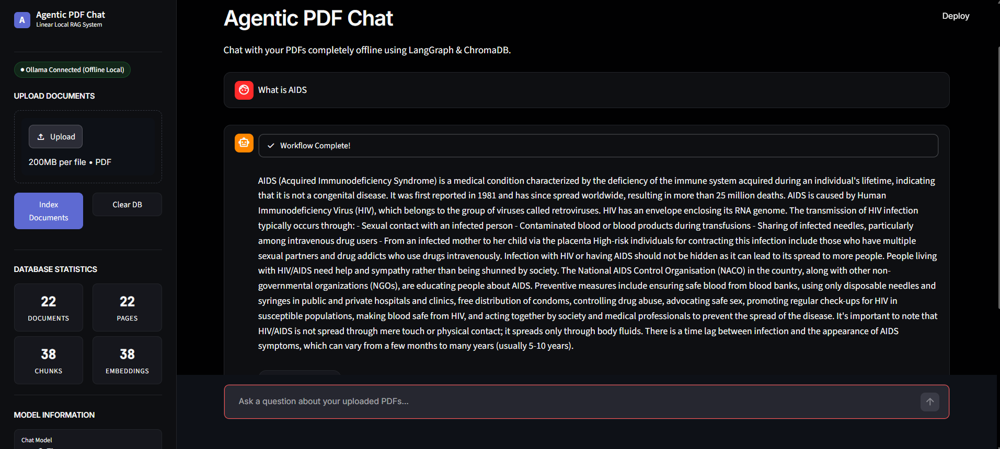
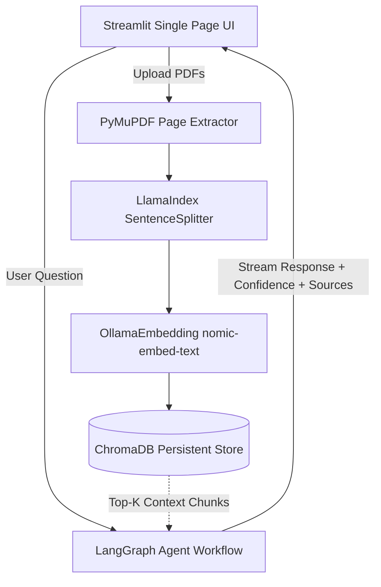
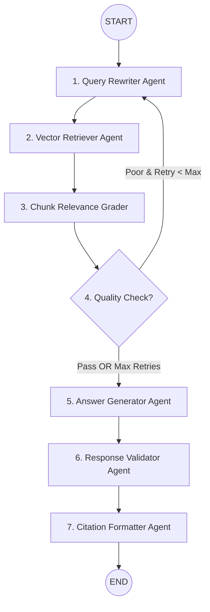

# Agentic RAG PDF Chat ⚡

A fully local and private Agentic RAG application for chatting with PDF documents completely offline. Powered by **LangGraph** for multi-agent reasoning, **LlamaIndex** and **PyMuPDF** for document processing, **ChromaDB** for vector storage, and local **Ollama** models (`qwen2:7b` + `nomic-embed-text`), built with a single-page Streamlit interface.

---

## 🖼️ Application Preview



---

## 📖 Setup Guide

1. **Clone & Install Dependencies**: Ensure Python 3.10+ is installed on your local machine, then run:
   ```bash
   pip install -r requirements.txt
   ```
2. **Pull Local Ollama Models**: Install [Ollama](https://ollama.ai) and pull the chat and embedding models:
   ```bash
   ollama pull qwen2:7b
   ollama pull nomic-embed-text
   ```
3. **Start Ollama Server**: Ensure the background daemon is running:
   ```bash
   ollama serve
   ```
4. **Launch Streamlit Application**:
   ```bash
   streamlit run app.py
   ```
   Open `http://localhost:8501` in your browser.

---

## 🏛️ Project Architecture

The application adopts a clean, decoupled architecture where document ingestion and vector retrieval are handled by LlamaIndex and persistent ChromaDB storage, while runtime reasoning and multi-step evaluation are executed via an autonomous LangGraph StateGraph pipeline, presented through a single-page Streamlit interface.



---

## 🔄 Agentic Workflow

The application runs a real LangGraph `StateGraph` workflow featuring autonomous query expansion, semantic context grading, conditional retry loops, response synthesis, and answer validation.



### Workflow Nodes Breakdown:
1. **Query Rewriter Agent**: Reformulates conversational user queries into keyword-dense, domain-specific search vectors.
2. **Vector Retriever Agent**: Queries local persistent ChromaDB vector storage for top-K matching semantic context chunks.
3. **Chunk Relevance Grader**: Evaluates retrieved passages against the original question to filter out noise.
4. **Decision Node**: Evaluates context quality. If retrieval is insufficient and maximum retries are not reached, it triggers a query rewrite loop.
5. **Answer Generator Agent**: Synthesizes a grounded response strictly based on verified document context.
6. **Response Validator Agent**: Assesses answer faithfulness, hallucinatory risk, and assigns a 0–100% confidence score.
7. **Citation Formatter Agent**: Extracts exact snippets, page numbers, and filenames for interactive citation UI.

---

## 🧰 Tools & Technologies Used

| Tool / Technology | Role & Usage |
|---|---|
| **Streamlit** | Single-page Python UI framework for document upload and interactive chat. |
| **LangGraph** | Multi-agent state machine orchestrating query rewrite loops and validation logic. |
| **LlamaIndex** | Document node parsing, semantic chunking (`SentenceSplitter`), and embedding integration. |
| **ChromaDB** | Local persistent vector database storing chunk embeddings and rich page metadata. |
| **PyMuPDF (`fitz`)** | Fast, high-accuracy PDF text extraction with page tracking. |
| **Ollama** | Local model runner serving `qwen2:7b` (LLM) and `nomic-embed-text` (Embedding). |
| **Pydantic & Python Typing** | Type safety, clean state definition, and schema validation. |
